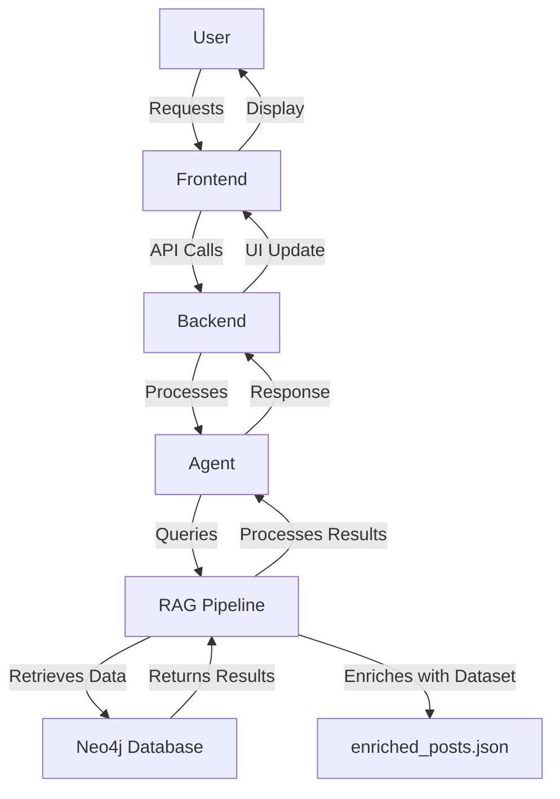

# Assignment Project

## Overview
This project implements a RAG (Retrieval-Augmented Generation) pipeline with Neo4j integration for data retrieval and processing.

## Project Structure

```
├── agent.py              # AI agent implementation
├── backend.py            # Backend server logic
├── frontend.py           # Frontend interface
├── main.py              # Main entry point
├── requirements.txt     # Python dependencies
├── Rag_Pipeline/        # RAG pipeline module
│   ├── neo4j_setup.py   # Neo4j database setup
│   ├── neo4j_retreival.py # Data retrieval from Neo4j
│   └── Dataset/
│       └── enriched_posts.json # Dataset for enrichment
└── README.md            # This file
```

## Installation

1. Install dependencies:
```bash
pip install -r requirements.txt
```

2. Set up environment variables in `.env` file

## Environment Configuration

Create a `.env` file in the project root with the following content (replace `XXX...` with your actual credentials):

```bash
GROQ_API_KEY=XXXXXXXX
PINECONE_API_KEY=XXXX_XXXX
PIXEL=XXXX XXXX
NEO4J_URI=XXXXXXXX
NEO4J_USERNAME=XXXXXXXX
NEO4J_PASSWORD=XXXX_XXXX
NEO4J_DATABASE=neo4j
AURA_INSTANCEID=b41f27a4
AURA_INSTANCENAME=XXXXXXXX
```
3. Configure Neo4j connection in the RAG Pipeline

## Usage

Run the main application:
```bash
python main.py
```
## Components

- **agent.py**: AI agent for handling requests
- **backend.py**: Backend server and API endpoints
- **frontend.py**: Frontend user interface
- **neo4j_setup.py**: Initialize Neo4j database
- **neo4j_retreival.py**: Query and retrieve data from Neo4j


## Architecture Diagram




## Requirements

See `requirements.txt` for all dependencies.

## License

This project is for educational purposes.
